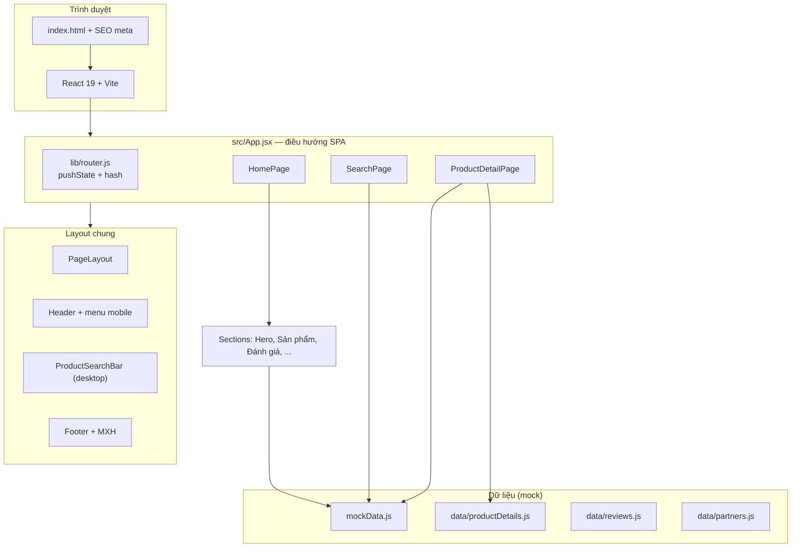
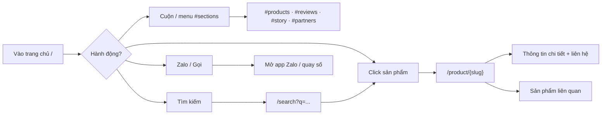
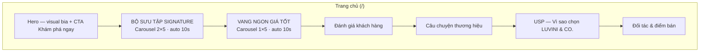
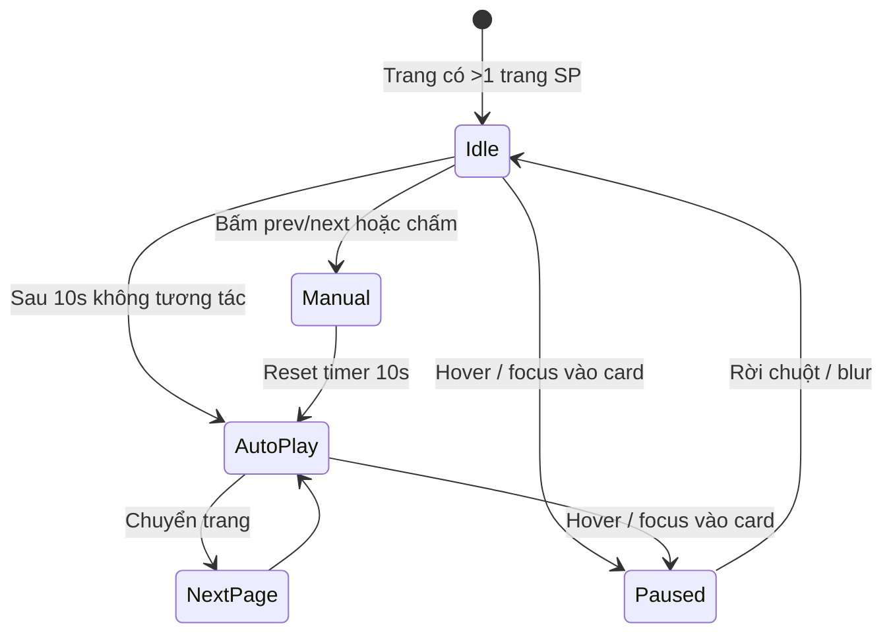
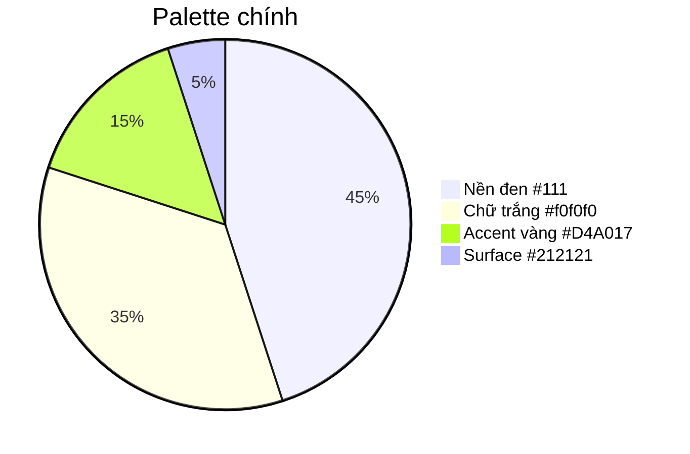
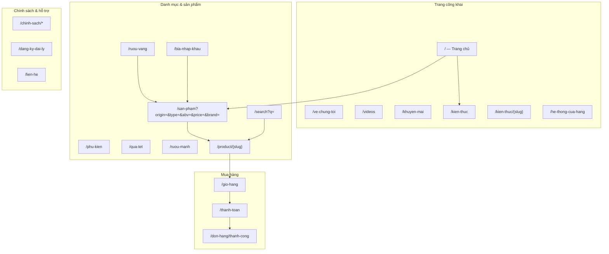
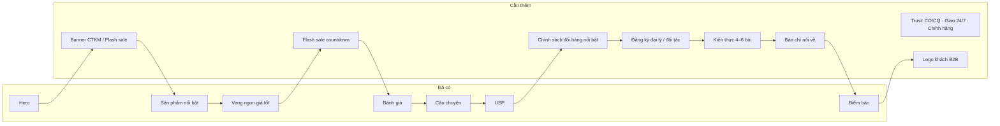
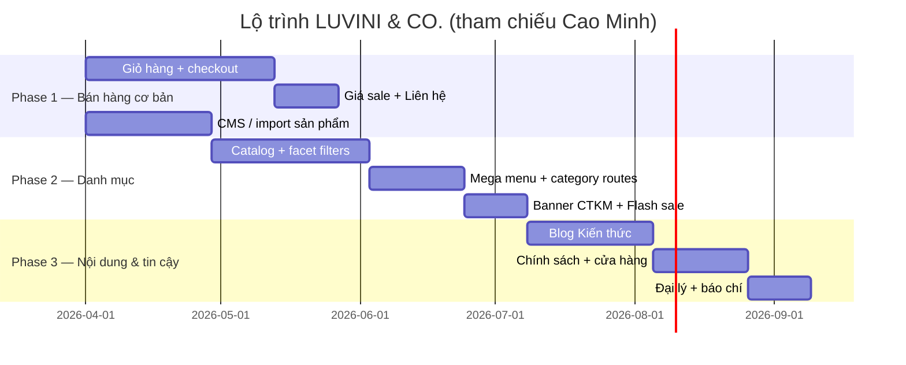
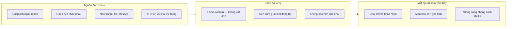
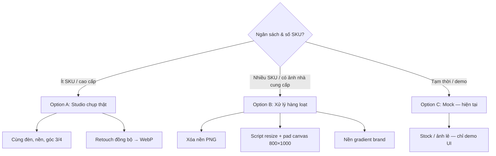

# LUVINI & CO.

Landing page **LUVINI & CO.** — *Curated Fine Wine & Imported Beer*, giao diện premium dark, tối ưu mobile, sẵn sàng triển khai static trên **Vercel**.

---

## 1. Tổng quan nhanh


| Hạng mục             | Mô tả                                                                        |
| -------------------- | ---------------------------------------------------------------------------- |
| **Thương hiệu**      | LUVINI & CO. — *"The Art of Fine Taste"* · Curated Fine Wine & Imported Beer |
| **Mục tiêu**         | Giới thiệu thương hiệu, showcase sản phẩm, kêu gọi liên hệ (Zalo / gọi điện) |
| **Dữ liệu hiện tại** | Mock data (~20 sản phẩm) — chưa nối API/backend                              |
| **Hotline demo**     | `0907566279`                                                                 |


---

## 2. Kiến trúc ứng dụng




---

## 3. Luồng người dùng (demo flow)




**Gợi ý khi trình bày:** bắt đầu Hero → carousel sản phẩm → tìm kiếm → mở 1 chi tiết → quay lại bằng menu → thử Zalo trên mobile.

---

## 4. Cấu trúc trang chủ




---

## 5. Danh sách chức năng đã triển khai

### 5.1 Thương hiệu & giao diện

- [x] **Nền đen premium** (`#111111`) + chữ trắng / xám dễ đọc
- [x] **Logo gradient vàng gold** — Header, Footer, Hero headline
- [x] **Nhãn section gradient** — *BỘ SƯU TẬP SIGNATURE*, *VANG NGON GIÁ TỐT*
- [x] Typography: **Be Vietnam Pro** (nội dung), **Playfair Display** (hero)
- [x] Hero không dùng ảnh stock — visual bia CSS/SVG (`HeroBeerVisual`)
- [x] Cảnh báo **18+** ở footer và trang chi tiết sản phẩm

### 5.2 Điều hướng & layout

- [x] **SPA nhẹ** (không React Router — `history.pushState` tự viết)
- [x] Header **sticky** (logo + nav desktop + icon Gọi/Zalo)
- [x] **Menu hamburger** mobile (điều hướng section, không trùng nút Zalo/Gọi)
- [x] **Tìm kiếm desktop**: thanh cố định dưới header
- [x] **Tìm kiếm mobile**: icon mở form, ô tìm thống nhất (icon submit trong khung)
- [x] Điều hướng **hash** từ mọi trang (`/#products`, `/#reviews`, …)
- [x] Container responsive `**.site-container`** (max ~1400px)

### 5.3 Sản phẩm

- [x] **20 sản phẩm mock** (`mockData.js`)
- [x] **BỘ SƯU TẬP SIGNATURE** — carousel nhiều trang (10/sp desktop), prev/next, chấm trang, tự chuyển 10s
- [x] **VANG NGON GIÁ TỐT** — 1 hàng × 5 (desktop), cùng cơ chế carousel
- [x] **Tạm dừng auto-slide** khi hover / focus vào thẻ sản phẩm
- [x] **ProductCard** — ảnh `object-contain`, nền gradient đồng bộ, mọi tỉ lệ ảnh vừa khung
- [x] Click card → **trang chi tiết** `/product/{slug}` (vd. `/product/sierra-nevada-pale-ale`)
- [x] Redirect legacy `/product/15` → slug đúng
- [x] Chi tiết: specs, hương vị, food pairing, highlights, **sản phẩm liên quan**
- [x] Ảnh chi tiết dùng chung style `**.product-media-well`** với card

### 5.4 Tìm kiếm

- [x] Trang `**/search?q=...`** — lọc theo tên, xuất xứ, style, ABV, mô tả
- [x] Enter / nút tìm → chuyển trang kết quả
- [x] Nút xoá từ khoá khi đang gõ

### 5.5 Liên hệ & chuyển đổi

- [x] **Zalo** + **Gọi điện** (header icon, chi tiết SP, footer ngữ cảnh)
- [x] CTA chính **"Khám phá ngay"** → scroll `#products`
- [x] Footer: social placeholder (IG / FB / TT), bản quyền

### 5.6 Nội dung marketing (trang chủ)

- [x] Hero + tagline *"The Art of Fine Taste"*
- [x] Đánh giá khách hàng (mock `reviews.js`)
- [x] Câu chuyện thương hiệu (curated wine & beer)
- [x] USP (chính hãng, tư vấn, giao nhanh, …)
- [x] Đối tác & điểm bán (`partners.js`)

### 5.7 Kỹ thuật & triển khai

- [x] **React 19 + Vite 8 + Tailwind CSS v4**
- [x] `**vercel.json`** — rewrite SPA về `index.html`
- [x] SEO cơ bản trong `index.html` (title, description, Open Graph)
- [x] Lazy load ảnh sản phẩm, focus/aria trên nút điều hướng

---

## 6. Bảng đường dẫn (routes)


| URL                               | Màn hình                    |
| --------------------------------- | --------------------------- |
| `/`                               | Trang chủ                   |
| `/#products`                      | Scroll tới Sản phẩm nổi bật |
| `/#reviews`                       | Đánh giá                    |
| `/#story`                         | Câu chuyện                  |
| `/#partners`                      | Điểm bán                    |
| `/search?q=bia`                   | Kết quả tìm kiếm            |
| `/product/sierra-nevada-pale-ale` | Chi tiết sản phẩm (slug)    |
| `/product/3`                      | Redirect → slug (legacy)    |


---

## 7. Carousel — hành vi demo




| Carousel          | Desktop        | Tablet | Mobile |
| ----------------- | -------------- | ------ | ------ |
| Sản phẩm nổi bật  | 5×2 (10/trang) | 3×2    | 2×2    |
| Vang ngon giá tốt | 5×1            | 3×1    | 2×1    |


---

## 8. Design system (theo brief khách)




| Token                  | Giá trị       | Dùng cho              |
| ---------------------- | ------------- | --------------------- |
| `premium-black`        | `#111111`     | Nền trang             |
| `premium-dark`         | `#212121`     | Card, panel           |
| `brand-amber`          | `#D4A017`     | Giá, nhãn, CTA, hover |
| `.brand-logo-gradient` | Gold gradient | Logo & nhãn section   |
| `.product-media-well`  | Gradient ấm   | Vùng ảnh sản phẩm     |


---

## 9. Kịch bản demo 10 phút (checklist)

1. **Mở trang chủ** — chỉ logo gradient, hero, không viền vàng trên header.
2. **Hero** — scroll nhẹ, bấm *Khám phá ngay* → nhảy `#products`.
3. **Sản phẩm nổi bật** — đợi auto-slide; hover 1 card → carousel dừng; bấm next/prev.
4. **Vang ngon giá tốt** — 1 hàng 5 sản phẩm desktop; cùng UX carousel.
5. **Mở 1 sản phẩm** — ảnh fit khung; đọc specs + Zalo/Gọi.
6. **Quay lại** — *Quay lại sản phẩm* hoặc logo.
7. **Tìm kiếm** — gõ *"IPA"* hoặc *"Bỉ"* → trang search.
8. **Mobile (DevTools)** — menu hamburger, icon tìm, icon Zalo/Gọi.
9. **Footer** — MXH + 18+.
10. **Triển khai** — `npm run build` → Vercel.

---

## 10. Hướng phát triển sau demo — tham chiếu [ruouvangcaominh.vn](https://ruouvangcaominh.vn/)

Mục tiêu dài hạn: **LUVINI & CO.** có đủ chức năng cốt lõi của một site thương mại rượu vang/bia nhập khẩu kiểu **Rượu Vang Cao Minh** (danh mục sâu, lọc sản phẩm, giỏ hàng, nội dung, chính sách, điểm bán).

### 10.1 So sánh nhanh: đã có vs cần làm


| Nhóm chức năng (Cao Minh)         | LUVINI & CO. hiện tại                | Cần bổ sung                            |
| --------------------------------- | ------------------------------------ | -------------------------------------- |
| Trang chủ + banner CTKM           | Hero (visual CSS), chưa banner promo | Banner carousel CTKM / Flash sale      |
| Sản phẩm bán chạy                 | ✅ `BestSellersSection` + carousel    | Gắn CMS, badge giảm giá %              |
| Vang ngon giá tốt                 | ✅ `ValueDealsSection`                | Lọc giá động từ DB                     |
| Tìm kiếm toàn site                | ✅ `/search?q=`                       | Gợi ý, lọc trên trang kết quả          |
| Chi tiết sản phẩm                 | ✅ `/product/{slug}`                  | Giá gốc / giá sale, “Liên hệ”, tồn kho |
| Menu danh mục đa cấp              | Nav anchor 4 section                 | **Mega menu** + trang danh mục         |
| Lọc SP (xuất xứ, loại, ABV, giá…) | Chỉ search text                      | **Trang catalog + facet filter**       |
| Giỏ hàng & thanh toán             | ❌                                    | Giỏ, checkout, xác nhận đơn            |
| Phụ kiện / quà tặng / rượu mạnh   | ❌                                    | Category riêng (tùy SKU thực tế)       |
| Chương trình ưu đãi               | ❌                                    | `/khuyen-mai`, Flash sale              |
| Kiến thức (blog)                  | File `articles.js` chưa dùng         | `/kien-thuc`, bài viết + tag           |
| Về thương hiệu / Videos           | Brand story section                  | `/ve-chung-toi`, `/videos`             |
| Đối tác / nhượng quyền            | USP + điểm bán ngắn                  | Form đăng ký đại lý                    |
| Báo chí / khách hàng B2B          | ❌                                    | Section logo + link báo                |
| Chính sách (đổi trả, ship…)       | `PoliciesSection` chưa gắn           | Trang policy tĩnh                      |
| Hệ thống cửa hàng                 | `AvailableAtSection` mock            | **Store locator** + bản đồ             |
| Hotline / Zalo / Messenger        | Zalo + Gọi                           | Thêm Messenger, chat widget            |
| Footer pháp lý                    | Footer cơ bản                        | Giấy phép KD, GP bán rượu, DMCA        |
| CMS / API                         | `mockData.js`                        | Backend hoặc headless CMS              |


### 10.2 Sơ đồ route mục tiêu (tham chiếu Cao Minh)




### 10.3 Menu & taxonomy sản phẩm (map từ Cao Minh → LUVINI & CO.)

Tham chiếu menu chính [ruouvangcaominh.vn](https://ruouvangcaominh.vn/):


| Menu Cao Minh                             | Gợi ý cho LUVINI & CO.                      | Route / ghi chú             |
| ----------------------------------------- | ------------------------------------------- | --------------------------- |
| **Rượu vang** → Xuất xứ (Pháp, Ý, Chile…) | **Rượu vang** + filter `origin`             | `/ruou-vang?origin=phap`    |
| **Loại vang** (đỏ, trắng, sparkling…)     | `category`: vang-do, vang-trang, champagne… | Facet trên catalog          |
| **Giống nho** (Cabernet, Merlot…)         | `grape` (nếu có metadata)                   | Facet — phase 2             |
| **Nồng độ**                               | `abv` / `alcohol`                           | Facet — đã có ABV trên card |
| **Dung tích**                             | `volume` (750ml, 375ml…)                    | Bổ sung field SP            |
| **Khoảng giá**                            | `<300k`, `300k–500k`…                       | Facet + section “giá tốt”   |
| **Thương hiệu**                           | `brand` / `brewery`                         | Facet + trang thương hiệu   |
| **Phụ kiện** (ly, khui, tủ…)              | **Phụ kiện bia/vang**                       | `/phu-kien`                 |
| **Rượu mạnh**                             | Tùy danh mục kinh doanh                     | `/ruou-manh`                |
| **Quà Tết** (hộp, giỏ)                    | **Quà tặng / combo**                        | `/qua-tang`                 |
| **Chương trình ưu đãi**                   | Flash sale, % giảm                          | `/khuyen-mai`               |
| **Kiến thức**                             | Blog pairing, review                        | `/kien-thuc`                |
| **Về Cao Minh**                           | Về LUVINI & CO.                             | `/ve-chung-toi`             |
| **Videos**                                | YouTube / TikTok embed                      | `/videos`                   |


**Bia nhập khẩu** (điểm khác biệt thương hiệu mình): thêm nhánh tương tự — `style` (IPA, Lager, Stout…), `origin`, `brewery` — song song `/bia-nhap-khau`.

### 10.4 Trang chủ — block cần bổ sung (theo Cao Minh)




### 10.5 Chức năng thương mại điện tử (ưu tiên cao)


| #   | Tính năng                 | Mô tả (như Cao Minh)                                       | Độ ưu tiên |
| --- | ------------------------- | ---------------------------------------------------------- | ---------- |
| 1   | **Giỏ hàng**              | Icon số lượng header, “Thêm vào giỏ”, toast thành công     | P0         |
| 2   | **Trang giỏ** `/gio-hang` | Sửa số lượng, xóa dòng, tạm tính                           | P0         |
| 3   | **Thanh toán**            | Form giao hàng + phương thức (COD, chuyển khoản, cổng sau) | P0         |
| 4   | **Giá & khuyến mãi**      | Giá gốc gạch, % giảm, giá “Liên hệ”                        | P0         |
| 5   | **Catalog + lọc**         | URL facet: xuất xứ, loại, ABV, khoảng giá, thương hiệu     | P1         |
| 6   | **Mega menu**             | Dropdown desktop + accordion mobile                        | P1         |
| 7   | **CMS sản phẩm**          | Admin hoặc Shopify/Strapi/Sanity                           | P1         |
| 8   | **Tài khoản** (tuỳ chọn)  | Đơn hàng, địa chỉ — phase sau                              | P2         |


### 10.6 Nội dung, tin cậy & vận hành


| #   | Tính năng             | Tham chiếu Cao Minh                                  |
| --- | --------------------- | ---------------------------------------------------- |
| 1   | Trang **Kiến thức**   | Top list bài (quà Tết, pairing, review…)             |
| 2   | **Chính sách**        | Đổi hàng, vận chuyển, thanh toán, bảo mật, khiếu nại |
| 3   | **Hệ thống cửa hàng** | Danh sách tỉnh/thành + hotline từng showroom         |
| 4   | **Đăng ký đại lý**    | Form + CRM (email/Zalo notification)                 |
| 5   | **Báo chí / đối tác** | Carousel logo + link bài báo                         |
| 6   | **Footer pháp lý**    | MST, GP bán buôn rượu, địa chỉ công ty               |
| 7   | **Analytics**         | GA4, Meta Pixel, heatmap                             |
| 8   | **SEO**               | Sitemap, schema `Product`, `Organization`            |


### 10.7 Lộ trình triển khai đề xuất




| Phase       | Thời gian gợi ý | Deliverable chính                                             |
| ----------- | --------------- | ------------------------------------------------------------- |
| **Phase 1** | 6–8 tuần        | Mua được online: giỏ → checkout → đơn (COD), sản phẩm từ CMS  |
| **Phase 2** | 6–8 tuần        | Trải nghiệm Cao Minh: lọc đa chiều, menu danh mục, khuyến mãi |
| **Phase 3** | 4–6 tuần        | Blog, policy, showroom, đối tác — hoàn thiện trust & SEO      |


### 10.8 Mapping route → file gợi ý (khi code)


| Route mục tiêu                              | File / module gợi ý                              |
| ------------------------------------------- | ------------------------------------------------ |
| `/san-pham`, `/ruou-vang`, `/bia-nhap-khau` | `pages/CatalogPage.jsx` + `lib/filters.js`       |
| `/gio-hang`                                 | `pages/CartPage.jsx` + `context/CartContext.jsx` |
| `/thanh-toan`                               | `pages/CheckoutPage.jsx`                         |
| `/khuyen-mai`                               | `pages/PromotionsPage.jsx`                       |
| `/kien-thuc`, `/kien-thuc/:slug`            | `pages/BlogListPage.jsx`, `BlogPostPage.jsx`     |
| `/ve-chung-toi`                             | `pages/AboutPage.jsx`                            |
| `/he-thong-cua-hang`                        | `pages/StoresPage.jsx`                           |
| `/chinh-sach/:slug`                         | `pages/PolicyPage.jsx`                           |
| `/dang-ky-dai-ly`                           | `pages/FranchisePage.jsx` + `InquiryForm.jsx`    |


### 10.9 Ghi chú

- **Đã align ý tưởng Cao Minh:** carousel *Sản phẩm bán chạy*, *Vang ngon giá tốt*, tìm kiếm, chi tiết SP, Zalo/Gọi, giao diện premium tối + gold.
- **Chưa có (cần phase sau):** giỏ hàng, lọc danh mục sâu, blog, flash sale, cửa hàng đầy đủ, form đại lý — đây là phần **roadmap có tham số rõ** từ đối thủ tham chiếu.
- Có thể trình bày Phase 1–3 như **báo giá / timeline** sau buổi demo.

---

## 11. Chạy project local

```bash
npm install
npm run dev
```

Build production:

```bash
npm run build
npm run preview
```

---

## 12. Cây thư mục chính (tham khảo)

```
src/
├── App.jsx                 # Router SPA
├── pages/
│   ├── HomePage.jsx
│   ├── SearchPage.jsx
│   └── ProductDetailPage.jsx
├── components/
│   ├── layout/             # Header, Footer, Search
│   ├── sections/           # Hero, BestSellers, ValueDeals, ...
│   ├── product/            # Card, Carousel
│   └── ui/                 # PrimaryCta, IconButton, FadeIn
├── lib/                    # router, products, formatters, links
├── data/                   # productDetails, reviews, partners
└── mockData.js
```

---

## 13. Quy chuẩn ảnh sản phẩm — giải thích & checklist chuẩn bị

> **Dùng mục này khi hỏi:** *“Sao ảnh trên web demo chưa đều như ruouvangcaominh?”*  
> **Câu trả lời ngắn:** Layout/code đã tối ưu để **mọi ảnh vừa khung**; để **nhìn đồng bộ như catalog thật** cần **bộ ảnh sản phẩm chuẩn hóa** do khách chuẩn bị (hoặc thuê chụp/xử lý).

### 13.1 Vì sao demo hiện tại chưa “đều mắt”?




| Lớp                 | Làm được                                                         | Không thay thế được                                     |
| ------------------- | ---------------------------------------------------------------- | ------------------------------------------------------- |
| **CSS / component** | Ảnh không tràn, không mất nắp chai; nền vùng ảnh card giống nhau | Cùng góc chụp, cùng độ lớn chai, cùng “cảm giác” studio |
| **Ảnh nguồn chuẩn** | Catalog chuyên nghiệp như đối thủ                                | —                                                       |


**Kết luận:** Ảnh ngẫu nhiên + CSS **đủ cho demo kỹ thuật**; **go-live** cần **asset có quy trình**.

### 13.2 Quy chuẩn kỹ thuật đề xuất (giao cho designer / photographer)

#### Kích thước & định dạng


| Hạng mục             | Card (listing)                | Trang chi tiết                              | Ghi chú                                |
| -------------------- | ----------------------------- | ------------------------------------------- | -------------------------------------- |
| **Canvas xuất file** | **800 × 1000 px** (tỉ lệ 4:5) | **1200 × 1200 px** (vuông) hoặc 1200 × 1500 | Cùng quy tắc cho mọi SKU               |
| **Định dạng**        | **WebP** (ưu tiên) hoặc PNG   | WebP / PNG                                  | JPG chỉ khi không có nền trong suốt    |
| **Dung lượng**       | ≤ 150 KB / ảnh                | ≤ 300 KB / ảnh                              | Nén TinyPNG / Squoosh trước khi upload |
| **Độ phân giải**     | 72–144 dpi (web)              | 72–144 dpi                                  | Không cần 300 dpi in ấn cho web        |


#### Bố cục trong khung (quan trọng nhất)

```
┌─────────────────────────────┐
│  padding trên ~8–12%        │
│                             │
│      ┌─────────┐            │
│      │  CHAI   │  ← chiều cao
│      │  / LON  │    sản phẩm ~75–85% khung
│      │         │    căn GIỮA NGANG
│      └─────────┘            │
│  padding dưới ~5–8%         │  ← đáy chai thẳng hàng các card
└─────────────────────────────┘
```


| Quy tắc                | Chi tiết                                                                                                               |
| ---------------------- | ---------------------------------------------------------------------------------------------------------------------- |
| **Góc chụp**           | 3/4 front — **một góc duy nhất** cho toàn bộ catalog                                                                   |
| **Căn chỉnh**          | Sản phẩm căn **giữa ngang**, **đáy** cùng một đường ảo                                                                 |
| **Chiều cao sản phẩm** | Chiếm **75–85%** chiều cao canvas (lon ngắn có thể 70%)                                                                |
| **Nền ảnh**            | **Một màu cố định** hoặc gradient nhẹ — khớp site: `#2c2924` → `#1e1e1e` (xem `.product-media-well` trong `index.css`) |
| **Không dùng**         | Ảnh lifestyle (bàn tiệc, tay cầm chai), nền trắng lệch tông, watermark lớn                                             |


#### Tên file & cấu trúc thư mục (gửi dev)

```
assets/products/
├── bia/
│   ├── sierra-nevada-pale-ale.webp      ← trùng slug sản phẩm
│   └── sierra-nevada-pale-ale-detail.webp
└── vang/
    ├── pasqua-passione-rosso.webp
    └── pasqua-passione-rosso-detail.webp
```


| Quy tắc đặt tên                       | Ví dụ                       |
| ------------------------------------- | --------------------------- |
| Chữ thường, không dấu, nối bằng `-`   | `duvel-belgian-strong.webp` |
| Trùng **slug** trong CMS / `mockData` | Dễ map tự động              |
| Suffix `-detail` (tuỳ chọn)           | Ảnh lớn cho trang chi tiết  |


### 13.3 Ba hướng chuẩn bị ảnh — khách chọn 1




| Option                  | Phù hợp                         | Ước lượng công việc                           | Chất lượng catalog |
| ----------------------- | ------------------------------- | --------------------------------------------- | ------------------ |
| **A — Chụp studio**     | 20–100 SKU, positioning premium | 1–3 ngày setup + ~5–10 phút/sản phẩm          | ★★★★★              |
| **B — Xử lý hàng loạt** | Có ảnh gốc từ hãng, nền lộn xộn | Template Figma/PS + batch (Photoroom, Sharp…) | ★★★★               |
| **C — Mock (demo)**     | Trước khi có hàng thật          | Không cần chuẩn bị                            | ★★ (layout only)   |


### 13.4 Checklist cần chuẩn bị trước go-live

**Bắt buộc**

- [ ] Danh sách SKU go-live (tên, slug, loại: bia / vang / phụ kiện)
- [ ] Ảnh từng SKU theo quy chuẩn **mục 13.2** (hoặc hợp đồng chụp/xử lý)
- [ ] Xác nhận **một** phong cách nền (màu đơn hoặc gradient brand)
- [ ] File đặt tên theo slug, gửi qua Drive / folder có cấu trúc

**Nên có**

- [ ] Ảnh chi tiết (cùng sản phẩm, độ phân giải cao hơn) cho trang `/product/{slug}`
- [ ] Ảnh nhãn mác / mặt sau (tuỳ ngành — chứng nhận CO/CQ)
- [ ] Alt text ngắn: `"Tên sản phẩm — LUVINI & CO."`

**Không bắt buộc cho phase 1**

- [ ] Ảnh lifestyle / banner chiến dịch (dùng section marketing riêng)
- [ ] Video 360° sản phẩm

### 13.5 Bảng giao việc: Ai làm gì?


| Việc                                            | Khách hàng         | Designer / Photographer | Dev                             |
| ----------------------------------------------- | ------------------ | ----------------------- | ------------------------------- |
| Cung cấp mẫu chai/lon thật hoặc ảnh gốc hãng    | ✅                  |                         |                                 |
| Chụp / retouch / xuất WebP đúng spec            |                    | ✅                       |                                 |
| Duyệt mẫu 3–5 ảnh pilot trước khi làm hàng loạt | ✅                  | ✅                       |                                 |
| Upload CMS + gắn URL vào sản phẩm               | ✅ (hoặc nhập liệu) |                         | ✅ (tích hợp API)                |
| Hiển thị đúng trên card & detail                |                    |                         | ✅ (đã có `.product-media-well`) |


**Pilot khuyến nghị:** Làm **5 sản phẩm mẫu** → duyệt trên staging → mới scale cả catalog.

### 13.7 Liên hệ với code hiện tại


| Thành phần code                     | Vai trò                                                     |
| ----------------------------------- | ----------------------------------------------------------- |
| `ProductCard.jsx`                   | Vùng `.product-media-well` — hiển thị ảnh đã chuẩn hóa      |
| `ProductDetailPage.jsx`             | Cùng class ảnh — dùng file `-detail` hoặc cùng file lớn hơn |
| `index.css` → `.product-media-well` | Nền gradient brand — **ảnh nên hòa với tông này**           |
| `mockData.js` → `image`             | Sau go-live: URL CDN thay link Unsplash                     |


**Sau khi có ảnh chuẩn:** Chỉ cần thay URL trong CMS / `mockData` — **không cần sửa layout card**.

### 13.7 Ước lượng khối lượng (tham khảo báo giá)


| Quy mô               | Số ảnh cần xử lý | Gợi ý thời gian (Option B)        |
| -------------------- | ---------------- | --------------------------------- |
| MVP                  | 20 SKU × 1 ảnh   | 2–4 ngày (có template)            |
| Catalog vừa          | 100 SKU          | 1–2 tuần                          |
| Full (kiểu Cao Minh) | 500+ SKU         | Studio + team nhập liệu, theo đợt |


---

*Tài liệu này phản ánh trạng thái codebase tại thời điểm demo. Cập nhật file khi thêm tính năng mới.*